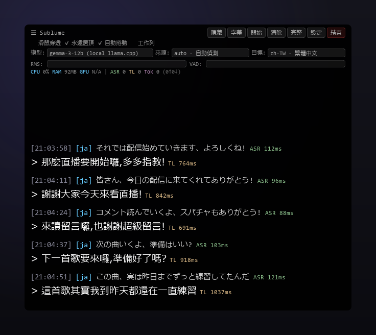
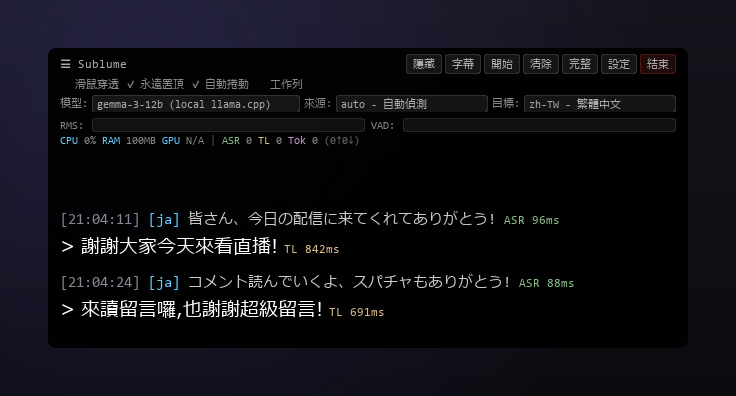
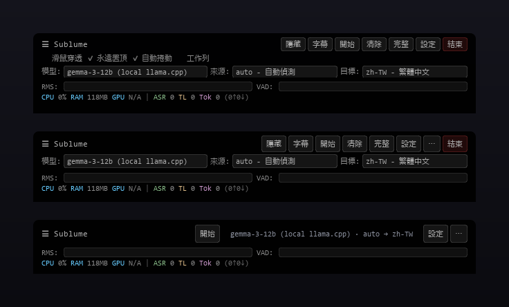
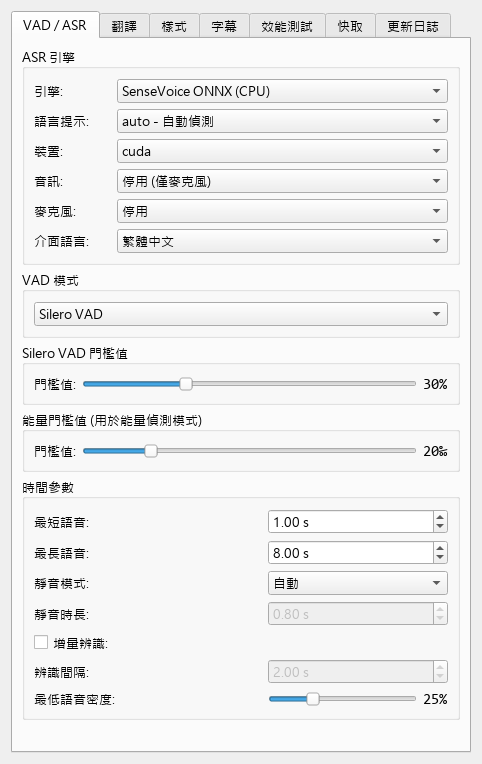
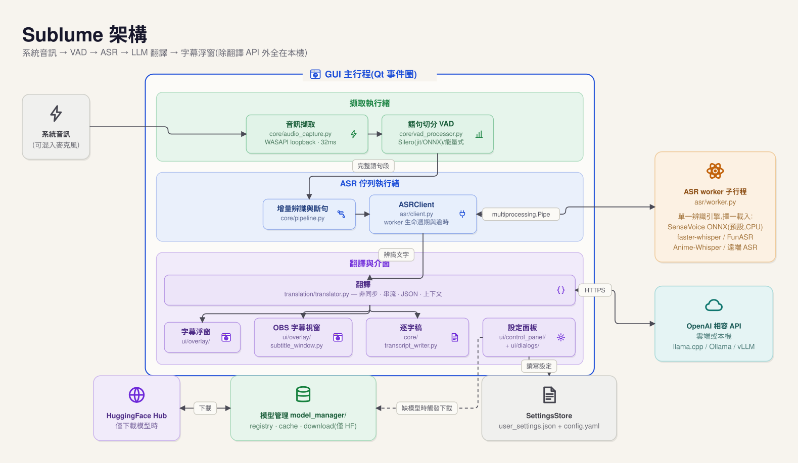

# Sublume

繁體中文｜[English](README_en.md)

**Sublume** 是 **Windows 與 macOS** 上的**即時翻譯字幕**工具：看直播、看影片時，直接擷取電腦正在播放的聲音，在本機完成語音辨識，再交由翻譯模型（OpenAI 相容的本地 LLM 或 API 皆可）翻譯，字幕以透明浮窗疊在畫面最上層。**直播翻譯**不需要動播放器或網站的任何設定——只要電腦放得出聲音，Sublume 就能提取出來，替它上字幕。




## 介面總覽

### 浮窗字幕（主介面）



半透明、永遠置頂、可滑鼠穿透的字幕浮窗——原文與譯文成對捲動，附辨識／翻譯延遲與資源監控列。
適合：看直播、看影片、語音通話，蓋在任何播放器上直接用。

浮窗頂欄有三種版面（設定 → 樣式），由上到下：**完整**（所有控制項）、**精簡**（開關收進選單）、**單列**（只留主要控制）：



### OBS 獨立字幕視窗


乾淨的描邊字幕視窗，專為 OBS 視窗擷取設計，每行字型、顏色、描邊與進出場動畫獨立可調。
適合：直播主要在自己的直播畫面上疊即時翻譯字幕。

### 控制面板



ASR 引擎、VAD 切分、翻譯模型、字幕樣式、效能測試、模型快取，全部改完即生效（自動儲存）。
適合：第一次調校完就收進系統匣，之後幾乎不用再打開。

## 運作方式

```
系統音訊 (WASAPI) → VAD (Silero) → 語音辨識 (ASR) → LLM 翻譯 → 字幕浮窗
        ↑ 可選擇混入麥克風
```

音訊以 32ms 為單位擷取，Silero VAD 切分出完整語句後送入 ASR，辨識結果再交由設定好的翻譯模型處理。除翻譯 API 外，整條管線皆在本機執行；預設引擎（SenseVoice ONNX）在 CPU 上即可即時辨識，選用 torch 系引擎且具備 NVIDIA 顯示卡時會以 CUDA 加速。

## 功能

- 多種 ASR 引擎可選：SenseVoice ONNX（預設，CPU 數秒啟動）、faster-whisper、SenseVoice、FunASR Nano，以及針對日語動畫與 Galgame 調校的 Anime-Whisper
- 翻譯支援任何 OpenAI 相容 API：OpenAI 等雲端服務，或 Ollama、llama.cpp server、vLLM 等本地服務皆可，搭配本地模型即可完全離線使用
- 本機沒有 GPU 時，語音辨識可交由區網內另一台 GPU 機器執行，詳見 [REMOTE_ASR.md](docs/REMOTE_ASR.md)
- 翻譯結果逐字串流顯示；串流、JSON 結構化輸出、上下文歷史、停用思考等選項可逐一針對各模型設定
- 麥克風輸入可混入管線一併辨識，語音通話時雙方語音皆可翻譯
- 字幕浮窗永遠置頂、滑鼠穿透、可拖曳，提供 14 種配色；另有獨立字幕視窗，方便 OBS 擷取
- 辨識與翻譯結果自動存成逐字稿
- 內建效能測試，可直接比較各翻譯模型的速度與品質

## 系統需求

- Windows 10 / 11
- macOS：Apple Silicon（M1 以上）、macOS 14（Sonoma）以上，實測於 macOS 15.5；目前為輕量安裝（不含 FunASR / Anime-Whisper 引擎），擷取系統聲音需安裝 BlackHole（見安裝說明）
- 不需預先安裝 Python：`install.bat` 會自動取得專用的 Python 3.12（暫不支援 3.13）
- **顯示卡非必需**：預設的「輕量」安裝純 CPU 即可即時辨識，整套約 1GB
- 要用 FunASR / Anime-Whisper 引擎才需要「完整」安裝：NVIDIA 顯示卡與 CUDA 12.6（RTX 50 系列需 CUDA 12.8），約 5GB
- 網路需能連上翻譯 API 與 HuggingFace（翻譯採用本地模型時，僅初次下載 ASR 模型需要網路）

## 安裝

### 免安裝版（不需安裝 Python）

從 [Releases](https://github.com/moonstarsky37/Sublume/releases) 下載 `Sublume-portable-*.zip`，解壓縮後執行 `start.bat`。首次執行會自動下載可攜版 Python 3.12，並依顯示卡選擇：有 NVIDIA 顯示卡裝「完整」版，沒有則自動採「輕量」版（約 1GB）。

### 從原始碼安裝

> 本節僅適用 `git clone` 取得的原始碼。免安裝版 zip **不含** `install.bat` 與 `scripts/`（首次執行 `start.bat` 會自動完成環境安裝，不需要本節的任何步驟）。

```bash
git clone https://github.com/moonstarsky37/Sublume.git
cd Sublume
```

執行 `install.bat`，安裝腳本會依序完成：

1. 偵測 [uv](https://docs.astral.sh/uv/)，未安裝時經 winget 自動安裝（無 winget 則改用官方安裝腳本）
2. 以 uv 專屬的 Python 3.12 建立虛擬環境（既有環境損壞或版本不符時會自動重建），完全不使用系統 Python
3. 選擇安裝方案：**輕量**（預設，約 1GB）或 **完整**（加裝 FunASR / Anime-Whisper 引擎需要的元件）；偵測到 NVIDIA 顯示卡時自動選擇對應的 CUDA 版本
4. 安裝相依套件並驗證完整性（通過才標記完成；中斷的安裝下次啟動會被擋下、要求重跑，不會拿半套環境開跑）

安裝過程會自動套用 Windows 系統 Proxy 設定。完成後執行 `start.bat` 啟動；日後執行 `update.bat` 即可更新（會自動更新你所選安裝方案的相依套件）。

<details>
<summary>手動安裝</summary>

```bash
python -m venv .venv
.venv\Scripts\activate

# 輕量 profile（無 torch，預設引擎 SenseVoice ONNX）
pip install -r requirements.txt

# 完整 profile（funasr / Anime-Whisper 引擎）：先裝 torch（三選一），再疊 torch 需求檔
pip install torch torchaudio --index-url https://download.pytorch.org/whl/cu126  # CUDA
pip install torch torchaudio --index-url https://download.pytorch.org/whl/cu128  # CUDA（RTX 50 系列）
pip install torch torchaudio --index-url https://download.pytorch.org/whl/cpu    # 僅 CPU
pip install -r requirements.txt
pip install -r requirements-torch.txt

.venv\Scripts\python.exe main.py
```

</details>

### macOS（原始碼安裝）

```bash
git clone https://github.com/moonstarsky37/Sublume.git
cd Sublume
./install.sh
```

安裝腳本會自動取得所需的一切（含專用的 Python 3.12）。完成後以 `./start.sh` 啟動，日後以 `./update.sh` 更新。

擷取系統聲音需要 BlackHole 虛擬裝置（一次性設定）：

1. `brew install blackhole-2ch`，裝完**重新開機**（重開機後 BlackHole 才會出現在裝置列表）
2. 用「音訊 MIDI 設定」建立「多重輸出裝置」（內建喇叭 + BlackHole 2ch），並在 系統設定 → 聲音 設為輸出
3. 首次開始擷取時，macOS 會詢問麥克風權限（對象是你的 Terminal）— 請允許；誤按拒絕的話，到 系統設定 → 隱私權與安全性 → 麥克風 勾回來，重開 Terminal 再啟動

## 首次啟動

首次啟動會出現設定精靈：先選辨識引擎（預設 SenseVoice ONNX，下載約 240MB；另一選項需 NVIDIA 顯示卡，約 1GB），按「開始下載」後抓取模型，完成後進入主介面。若連線 HuggingFace 不穩定，可於精靈內填入下載 Proxy。

### 模型下載的速度與穩定性

- 下載失敗（出現 500 或 CAS 字樣的錯誤）多為 HuggingFace 端暫時性故障，按「重試」即可續傳；已下載的部分不會重來。
- HuggingFace 對匿名下載有限流。若下載緩慢，可至 [huggingface.co](https://huggingface.co/settings/tokens) 免費申請 token，填入「設定 → 快取」的 HF Token 欄位；或在 cmd 執行 `setx HF_TOKEN hf_你的token` 後**重新啟動程式**（程式會自動讀取環境變數）。
- 精靈中的 Proxy 設定只影響模型下載；台灣一般網路環境選「不使用 Proxy」即可。
- 中途關閉程式不會壞事：設定已在按下「開始下載」當下寫入，下次啟動會直接從缺少的模型續傳，不會重跑精靈。

## 設定翻譯 API

設定 → 翻譯標籤頁。以本機 llama.cpp server（`llama-server`）為例：

| 參數 | 範例（本機 llama-server） |
|------|------|
| API Base | `http://localhost:8080/v1` |
| API Key | 任意非空值（如 `sk-local`，本機服務不驗證） |
| Model | llama-server 載入的模型別名，例如 `translategemma` |
| Proxy | `none`（本機直連，避免被系統 Proxy 攔截） |

搭配本機模型即可完全離線使用。其他服務設定方式相同，換掉 API Base 與 Model 即可：Ollama 為 `http://localhost:11434/v1`、vLLM 亦同；雲端服務如 OpenAI 填 `https://api.openai.com/v1` + `gpt-4o-mini` 並使用正式 API Key。

## 專案結構

根目錄的 `main.py` 只是啟動入口，實際程式碼在 `sublume/` 套件內。`python main.py`、`python -m sublume`、`start.bat` 三種啟動方式等價。

```
sublume/
├── main.py             應用程式主體與啟動流程
├── paths.py            執行期資料路徑（config.yaml、models/、logs/、transcripts/）
├── config/             Settings dataclass 與 SettingsStore（user_settings.json 唯一出入口）
├── model_manager/      模型偵測、下載（HuggingFace）與快取管理
├── assets/             內建 Silero VAD ONNX 模型（來源說明見其 README）
├── benchmark.py        翻譯效能測試
├── core/               音訊擷取（WASAPI loopback）、Silero VAD（jit／ONNX）、增量斷句、逐字稿寫入
├── asr/                各 ASR 後端、worker 子行程、遠端 ASR 伺服器與用戶端
├── translation/        OpenAI 相容翻譯用戶端（串流、JSON、上下文）
├── ui/                 設定面板、對話框、日誌視窗、字幕浮窗與 OBS 字幕視窗
└── i18n/               介面語系檔與更新日誌
funasr_nano/            內建模型程式碼
```

## 源起與差異

Sublume 的前身是 [TheDeathDragon/LiveTranslate](https://github.com/TheDeathDragon/LiveTranslate)（MIT）的 fork，2026-08 起改以現名獨立維護。相對原專案的主要差異：

- **SenseVoice ONNX 為預設辨識引擎**（sherpa-onnx）：CPU 上數秒啟動、不需 CUDA，模型 240MB（torch 版 936MB）。
- **torch 是可選依賴**：VAD 與預設引擎都走 ONNX，輕量安裝整套約 1GB（原本約 5GB）。
- **安裝不需預裝 Python**：`install.bat` 經 uv 自動取得 Python 3.12，並依顯示卡自動選擇 CUDA 或 CPU 版。
- **模型改從 HuggingFace 下載**。上游預設走 ModelScope，在部分網路環境幾乎連不上；之前下載好的模型不受影響，不用重抓。
- **初始設定流程重做**，不會再自己倒數 15 秒就開始下載；中途關掉程式，下次打開會從斷掉的地方繼續。
- **介面與文件改以繁體中文為主**，英文與簡體中文照常維護。
- **修了不少日常使用的 bug**。
- **補上測試與 CI**。
- **內部大幅重構**。原本幾個兩千多行的大檔案拆成小模組。

## 更新日誌

[繁體中文](sublume/i18n/CHANGELOG_zh-TW.md) | [English](sublume/i18n/CHANGELOG_en.md)

## 架構

整條管線在本機的三種執行單位之間流動：GUI 主行程負責介面與翻譯、背景執行緒負責音訊與排隊、ASR worker 子行程獨佔辨識引擎（切換引擎時直接汰換子行程，模型與 VRAM 隨行程釋放，GUI 永不卡死）。



架構細節與圖的維護方式見 [docs/architecture.md](docs/architecture.md)。

設定檔的儲存即使程式中途當掉也不會損毀，舊版設定檔會自動升級。

## 致謝

Sublume 源自 [TheDeathDragon/LiveTranslate](https://github.com/TheDeathDragon/LiveTranslate)（MIT），音訊管線、辨識引擎整合與字幕介面的核心實作源自該專案。

- [faster-whisper](https://github.com/SYSTRAN/faster-whisper) — 基於 CTranslate2 的 Whisper 推論
- [FunASR](https://github.com/modelscope/FunASR) — SenseVoice / Fun-ASR-Nano
- [Anime-Whisper](https://huggingface.co/litagin/anime-whisper) — 日語動畫/Galgame 專用 ASR
- [Silero VAD](https://github.com/snakers4/silero-vad) — 語音活動偵測

## 授權

[MIT License](LICENSE)
