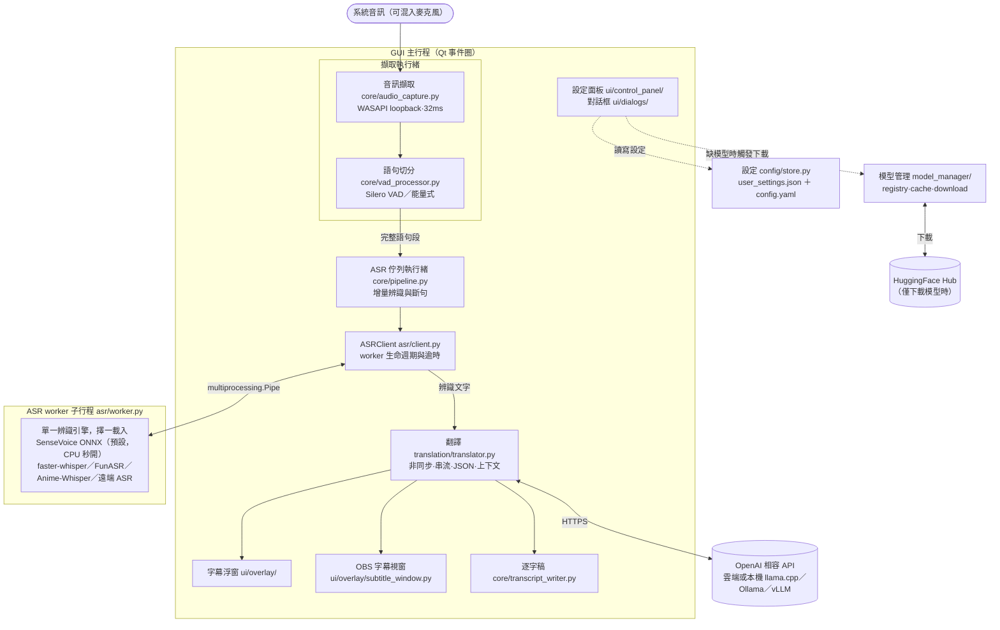

# Sublume

繁體中文｜[English](README_en.md)

Sublume 是 Windows 上的即時語音翻譯工具：擷取系統正在播放的音訊，經語音辨識後交由 LLM 翻譯，字幕以透明浮窗顯示在畫面最上層。觀看外語影片、直播，或進行語音通話時，不需修改播放器的任何設定即可使用。


## 運作方式

```
系統音訊 (WASAPI) → VAD (Silero) → 語音辨識 (ASR) → LLM 翻譯 → 字幕浮窗
        ↑ 可選擇混入麥克風
```

音訊以 32ms 為單位擷取，Silero VAD 切分出完整語句後送入 ASR，辨識結果再交由設定好的翻譯模型處理。除翻譯 API 外，整條管線皆在本機執行；具備 NVIDIA 顯示卡時，ASR 會以 CUDA 加速。

## 功能

- 多種 ASR 引擎可選：faster-whisper、SenseVoice、FunASR Nano，以及針對日語動畫與 Galgame 調校的 Anime-Whisper
- 翻譯支援任何 OpenAI 相容 API：OpenAI 等雲端服務，或 Ollama、llama.cpp server、vLLM 等本地服務皆可，搭配本地模型即可完全離線使用
- 本機沒有 GPU 時，語音辨識可交由區網內另一台 GPU 機器執行，詳見 [REMOTE_ASR.md](docs/REMOTE_ASR.md)
- 翻譯結果逐字串流顯示；串流、JSON 結構化輸出、上下文歷史、停用思考等選項可逐一針對各模型設定
- 麥克風輸入可混入管線一併辨識，語音通話時雙方語音皆可翻譯
- 字幕浮窗永遠置頂、滑鼠穿透、可拖曳，提供 14 種配色；另有獨立字幕視窗，方便 OBS 擷取
- 辨識與翻譯結果自動存成逐字稿
- 內建效能測試，可直接比較各翻譯模型的速度與品質

## 系統需求

- Windows 10 / 11
- 不需預先安裝 Python：`install.bat` 會經 uv 自動取得 Python 3.12（3.13 因相依套件尚未支援而排除）
- 建議配備 NVIDIA 顯示卡與 CUDA 12.6（RTX 50 系列等 Blackwell 架構需 CUDA 12.8）；純 CPU 亦可執行，惟辨識速度較慢
- 網路需能連上翻譯 API 與 HuggingFace（翻譯採用本地模型時，僅初次下載 ASR 模型需要網路）

## 安裝

### 免安裝版（不需安裝 Python）

從 [Releases](https://github.com/moonstarsky37/Sublume/releases) 下載 `Sublume-portable-*.zip`，解壓縮後執行 `start.bat`。首次執行會自動下載可攜版 Python 3.12，並依照顯示卡安裝對應的相依套件。

### 從原始碼安裝

> 本節僅適用 `git clone` 取得的原始碼。免安裝版 zip **不含** `install.bat` 與 `scripts/`（首次執行 `start.bat` 會自動完成環境安裝，不需要本節的任何步驟）。

```bash
git clone https://github.com/moonstarsky37/Sublume.git
cd Sublume
```

執行 `install.bat`，安裝腳本會依序完成：

1. 偵測 [uv](https://docs.astral.sh/uv/)，未安裝時經 winget 自動安裝（無 winget 則改用官方安裝腳本）
2. 以 uv 專屬的 Python 3.12 建立虛擬環境（既有環境損壞或版本不符時會自動重建），完全不使用系統 Python
3. 偵測 NVIDIA 顯示卡與運算能力，自動判斷 CUDA 12.6 或 12.8，安裝前可改選 CPU 版
4. 安裝 PyTorch 與其餘相依套件

安裝過程會自動套用 Windows 系統 Proxy 設定。完成後執行 `start.bat` 啟動；日後執行 `update.bat` 即可更新（未安裝 Git 時同樣會經 winget 自動安裝）。

<details>
<summary>手動安裝</summary>

```bash
python -m venv .venv
.venv\Scripts\activate

# PyTorch（三選一）
pip install torch torchaudio --index-url https://download.pytorch.org/whl/cu126  # CUDA
pip install torch torchaudio --index-url https://download.pytorch.org/whl/cu128  # CUDA（RTX 50 系列）
pip install torch torchaudio --index-url https://download.pytorch.org/whl/cpu    # 僅 CPU

pip install -r requirements.txt
.venv\Scripts\python.exe main.py
```

</details>

## 首次啟動

首次啟動會出現設定精靈：按「開始下載」即會抓取 Silero VAD 與 SenseVoice 模型（約 1GB），完成後進入主介面。若連線 HuggingFace 不穩定，可於精靈內填入下載 Proxy。

### 模型下載的速度與穩定性

- 下載失敗（如 500 / CAS 錯誤）多為 HuggingFace 端暫時性故障，按「重試」即可續傳；已下載的部分不會重來。
- HuggingFace 對匿名下載有限流。若下載緩慢，可至 [huggingface.co](https://huggingface.co/settings/tokens) 免費申請 token，在 cmd 執行 `setx HF_TOKEN hf_你的token` 後**重新啟動程式**即可生效（程式會自動讀取，無需改任何設定檔）。目前尚無 GUI 設定欄位（規劃中）。
- 精靈中的 Proxy 設定只影響模型下載；台灣一般網路環境選「不使用 Proxy」即可。
- 中途關閉程式不會壞事：設定已在按下「開始下載」當下寫入，下次啟動會直接從缺少的模型續傳，不會重跑精靈。

## 設定翻譯 API

設定 → 翻譯標籤頁。以本機 llama.cpp server（`llama-server`）為例：

| 參數 | 範例（本機 llama-server） |
|------|------|
| API Base | `http://localhost:8080/v1` |
| API Key | 任意非空值（如 `sk-local`，本機服務不驗證） |
| Model | llama-server 載入的模型別名，例如 `translategemma` |
| Proxy | `none`（本機直連，避免被系統 Proxy 攔截） |

搭配本機模型即可完全離線使用。其他服務設定方式相同，換掉 API Base 與 Model 即可：Ollama 為 `http://localhost:11434/v1`、vLLM 亦同；雲端服務如 OpenAI 填 `https://api.openai.com/v1` + `gpt-4o-mini` 並使用正式 API Key。

## 專案結構

根目錄的 `main.py` 為入口 shim，實際程式碼在 `sublume/` 套件內。`python main.py`、`python -m sublume`、`start.bat` 三種啟動方式等價。

```
sublume/
├── main.py             應用程式主體與啟動流程
├── paths.py            執行期資料路徑（config.yaml、models/、logs/、transcripts/）
├── model_manager/      模型偵測、下載（HuggingFace）與快取管理
├── benchmark.py        翻譯效能測試
├── core/               音訊擷取（WASAPI loopback）、Silero VAD、逐字稿寫入
├── asr/                各 ASR 後端、worker 子行程、遠端 ASR 伺服器與用戶端
├── translation/        OpenAI 相容翻譯用戶端（串流、JSON、上下文）
├── ui/                 設定面板、對話框、日誌視窗、字幕浮窗與 OBS 字幕視窗
└── i18n/               介面語系檔與更新日誌
funasr_nano/            vendored 模型程式碼
```

## 本 fork 與上游的差異

fork 自 [TheDeathDragon/LiveTranslate](https://github.com/TheDeathDragon/LiveTranslate)，主要改了這些：

- **模型改從 HuggingFace 下載**。上游預設走 ModelScope，在部分網路環境幾乎連不上；之前下載好的模型不受影響，不用重抓。
- **初始設定流程重做**，不會再自己倒數 15 秒就開始下載；中途關掉程式，下次打開會從斷掉的地方繼續。
- **介面與文件改以繁體中文為主**，英文與簡體中文照常維護。
- **修了不少日常使用的 bug**。
- **補上測試與 CI**。
- **內部大幅重構**。原本幾個兩千多行的大檔案拆成小模組。

## 更新日誌

[繁體中文](sublume/i18n/CHANGELOG_zh-TW.md) | [English](sublume/i18n/CHANGELOG_en.md)

## 架構

整條管線在本機的三種執行單位之間流動：GUI 主行程負責介面與翻譯、背景執行緒負責音訊與排隊、ASR worker 子行程獨佔辨識引擎（切換引擎時直接汰換子行程，模型與 VRAM 隨行程釋放，GUI 永不卡死）。



跨執行緒的 UI 更新一律走 Qt signal；設定檔讀寫只經過 `SettingsStore`（原子寫入＋載入時遷移）。

## 致謝

本專案 fork 自 [TheDeathDragon/LiveTranslate](https://github.com/TheDeathDragon/LiveTranslate)（MIT），音訊管線、辨識引擎整合與字幕介面的核心實作源自上游。

- [faster-whisper](https://github.com/SYSTRAN/faster-whisper) — 基於 CTranslate2 的 Whisper 推論
- [FunASR](https://github.com/modelscope/FunASR) — SenseVoice / Fun-ASR-Nano
- [Anime-Whisper](https://huggingface.co/litagin/anime-whisper) — 日語動畫/Galgame 專用 ASR
- [Silero VAD](https://github.com/snakers4/silero-vad) — 語音活動偵測

## 授權

[MIT License](LICENSE)
