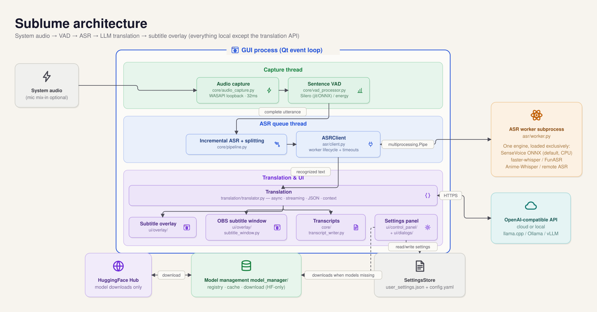

# Sublume

[繁體中文](README.md)｜English

**Sublume** puts **real-time translated subtitles** on Windows (a macOS version is in progress): while you watch live streams or videos, it captures the audio your PC is playing, runs speech recognition locally, hands the text to a translation model (any OpenAI-compatible local LLM or API), and lays the subtitles over the screen in a transparent overlay. A **live stream translator** that lets you watch streams with subtitles without touching any player or website settings — if your computer can play the sound, Sublume can pull it out and subtitle it.


## The interfaces

### Floating subtitle overlay (the main one)


Translucent, always-on-top, click-through — original and translated lines scroll in pairs, with recognition/translation latency and resource stats in the monitor bar.
For: watching live streams, videos and voice calls; drop it over any player and go.

The overlay header comes in three layouts (Settings → Style), top to bottom: **Classic** (all controls), **Compact** (toggles in menu), **Minimal** (single row):


### Standalone OBS subtitle window


A clean outlined-text subtitle window built for OBS window capture, with per-line font, color, outline and enter/exit animations.
For: streamers putting live-translated subtitles on their own broadcast.

### Control panel


ASR engine, VAD segmentation, translation models, subtitle styling, benchmark and model cache — every change applies as you make it (auto-save).
For: tune it once, then leave it in the tray.

## How it works

```
System audio (WASAPI) → VAD (Silero) → ASR → LLM translation → Overlay
        ↑ optional mic mix-in
```

Audio is captured in 32ms chunks; Silero VAD segments complete utterances and feeds them to the ASR engine, whose output goes to the configured translation model. Everything except the translation API runs locally; the default engine (SenseVoice ONNX) transcribes in real time on a CPU, and the torch-based engines are CUDA-accelerated when an NVIDIA GPU is present.

## Features

- Multiple ASR engines: SenseVoice ONNX (default; starts in seconds on a CPU), faster-whisper, SenseVoice, FunASR Nano, and Anime-Whisper (tuned for Japanese anime and galgames)
- Translation via any OpenAI-compatible API: cloud services such as OpenAI, or local ones such as Ollama, llama.cpp server, and vLLM — with a local model the whole pipeline runs offline
- Without a local GPU, speech recognition can be offloaded to another GPU machine on the LAN — see [REMOTE_ASR.md](docs/REMOTE_ASR.md)
- Streaming character-by-character output; streaming, structured JSON, context history, and thinking can each be configured per model
- Microphone mix-in, so both sides of a voice call get translated
- Always-on-top overlay with click-through, dragging, and 14 color themes, plus a standalone subtitle window for OBS capture
- Transcripts of recognition and translation results are saved automatically
- Built-in benchmark for comparing translation models on speed and quality

## Requirements

- Windows 10 / 11 (a macOS version is in progress and not yet usable)
- No preinstalled Python needed: `install.bat` fetches its own Python 3.12 (3.13 is not supported yet)
- **No GPU required**: the default Lightweight install transcribes in real time on a CPU, and the whole install is about 1GB
- The Full install is only needed for the FunASR / Anime-Whisper engines: an NVIDIA GPU with CUDA 12.6 (RTX 50 series needs CUDA 12.8), about 5GB
- Network access to the translation API and HuggingFace (with a local translation model, network is only needed for the initial ASR model download)

## Install

### Portable build (no Python installation required)

Download `Sublume-portable-*.zip` from [Releases](https://github.com/moonstarsky37/Sublume/releases), unzip, and run `start.bat`. The first run downloads a portable Python 3.12 and picks by GPU: machines with an NVIDIA GPU get the Full install, everything else gets the Lightweight one (~1GB).

### From source

> This section only applies to a `git clone` checkout. The portable zip does **not** contain `install.bat` or `scripts/` — its first `start.bat` run sets up the environment by itself, and none of the steps below are needed.

```bash
git clone https://github.com/moonstarsky37/Sublume.git
cd Sublume
```

Run `install.bat`. The installer will:

1. Detect [uv](https://docs.astral.sh/uv/), installing it via winget if missing (falling back to the official install script)
2. Create the virtual environment from uv's own Python 3.12 — never the system Python (a broken or wrong-version venv is rebuilt automatically)
3. Ask which install you want: **Lightweight** (default, ~1GB) or **Full** (adds what the FunASR / Anime-Whisper engines need); with an NVIDIA GPU it picks the matching CUDA version automatically
4. Install and verify the dependencies (completion is only marked after verification passes; an interrupted install is caught at the next launch and sent back to the installer instead of running on half an environment)

The Windows system proxy is applied automatically during installation. Run `start.bat` to launch, and `update.bat` later to update (it updates the dependencies for whichever install you chose).

<details>
<summary>Manual install</summary>

```bash
python -m venv .venv
.venv\Scripts\activate

# Lightweight profile (no torch; SenseVoice ONNX as the default engine)
pip install -r requirements.txt

# Full profile (funasr / Anime-Whisper engines): install torch first (pick one), then layer the torch requirements
pip install torch torchaudio --index-url https://download.pytorch.org/whl/cu126  # CUDA
pip install torch torchaudio --index-url https://download.pytorch.org/whl/cu128  # CUDA (RTX 50 series)
pip install torch torchaudio --index-url https://download.pytorch.org/whl/cpu    # CPU only
pip install -r requirements.txt
pip install -r requirements-torch.txt

.venv\Scripts\python.exe main.py
```

</details>

## First launch

A setup wizard appears on first launch: pick the recognition engine (SenseVoice ONNX by default, a ~240MB download; the other option needs an NVIDIA GPU and is ~1GB), then click Start Download. The main UI opens once downloads finish. A download proxy can be set in the wizard if the connection to HuggingFace is unreliable.

### Download speed and reliability

- Download failures (errors mentioning 500 or CAS) are usually transient HuggingFace-side problems; Retry resumes the download, and finished parts are not re-fetched.
- HuggingFace rate-limits anonymous downloads. If they crawl, get a free token at [huggingface.co](https://huggingface.co/settings/tokens) and paste it into the HF Token field under Settings → Cache; or run `setx HF_TOKEN hf_yourtoken` in cmd and **restart the app** (the environment variable is picked up automatically).
- The wizard's proxy setting only affects model downloads.
- Closing the app mid-download is safe: settings are saved the moment you click Start Download, and the next launch resumes from the missing models instead of re-running the wizard.

## Translation API

Settings → Translation tab. Using a local llama.cpp server (`llama-server`) as the example:

| Parameter | Example (local llama-server) |
|-----------|---------|
| API Base | `http://localhost:8080/v1` |
| API Key | any non-empty value (e.g. `sk-local`; local servers don't check it) |
| Model | the model alias loaded by llama-server, e.g. `translategemma` |
| Proxy | `none` (direct local connection, bypassing any system proxy) |

With a local model the whole pipeline runs offline. Other services are configured the same way — just swap API Base and Model: `http://localhost:11434/v1` for Ollama (vLLM likewise), or a cloud service such as OpenAI with `https://api.openai.com/v1` + `gpt-4o-mini` and a real API key.

## Project layout

`main.py` at the repository root is just the launch entry point; the actual code lives in the `sublume/` package. `python main.py`, `python -m sublume`, and `start.bat` are equivalent ways to launch.

```
sublume/
├── main.py             Application core and startup flow
├── paths.py            Runtime data paths (config.yaml, models/, logs/, transcripts/)
├── config/             Settings dataclass and SettingsStore (sole gateway to user_settings.json)
├── model_manager/      Model detection, download (HuggingFace), and cache management
├── assets/             Bundled Silero VAD ONNX model (source notes in its README)
├── benchmark.py        Translation benchmark
├── core/               Audio capture (WASAPI loopback), Silero VAD (jit/ONNX), incremental segmentation, transcript writer
├── asr/                ASR backends, worker subprocess, remote ASR server and client
├── translation/        OpenAI-compatible translation client (streaming, JSON, context)
├── ui/                 Settings panel, dialogs, log window, overlay, OBS subtitle window
└── i18n/               UI locales and changelogs
funasr_nano/            Bundled model code
```

## Origin and differences

Sublume began as a fork of [TheDeathDragon/LiveTranslate](https://github.com/TheDeathDragon/LiveTranslate) (MIT) and has been maintained independently under its current name since 2026-08. The main differences from the original:

- **SenseVoice ONNX is the default recognition engine** (sherpa-onnx): starts in seconds on a CPU, needs no CUDA, and the model is 240MB (vs 936MB for the torch build).
- **torch is an optional dependency:** the VAD and the default engine both run on ONNX; the lightweight install is about 1GB total (down from ~5GB).
- **No preinstalled Python:** `install.bat` fetches Python 3.12 through uv and picks the CUDA or CPU build to match the GPU.
- **Models come from HuggingFace.** Upstream defaults to ModelScope, which is barely reachable on some networks; models you already downloaded keep working.
- **The first-run setup was redone** — no more 15-second auto-start countdown; close the app mid-download and the next launch resumes where it left off.
- **The UI and docs lead with Traditional Chinese**, and English and Simplified Chinese are still maintained.
- **Fixed plenty of everyday bugs.**
- **Added tests and CI.**
- **Major internal refactoring.** The multi-thousand-line source files are now small modules.

## Changelog

[English](sublume/i18n/CHANGELOG_en.md) | [繁體中文](sublume/i18n/CHANGELOG_zh-TW.md)

## Architecture

The pipeline flows through three kinds of execution units, all local: the GUI process owns the interface and translation, background threads own audio and queuing, and an ASR worker subprocess owns the recognition engine (switching engines replaces the subprocess, so models and VRAM are freed with it and the GUI never blocks).



Architecture details and diagram maintenance: [docs/architecture.md](docs/architecture.md).

Settings are stored so that even a mid-write crash cannot corrupt them, and settings from older versions upgrade automatically.

## Acknowledgements

Sublume grew out of [TheDeathDragon/LiveTranslate](https://github.com/TheDeathDragon/LiveTranslate) (MIT); the core implementation of the audio pipeline, ASR engine integration and subtitle UI originated in that project.

- [faster-whisper](https://github.com/SYSTRAN/faster-whisper) — Whisper inference via CTranslate2
- [FunASR](https://github.com/modelscope/FunASR) — SenseVoice / Fun-ASR-Nano
- [Anime-Whisper](https://huggingface.co/litagin/anime-whisper) — Japanese anime/galgame ASR
- [Silero VAD](https://github.com/snakers4/silero-vad) — Voice activity detection

## License

[MIT License](LICENSE)
