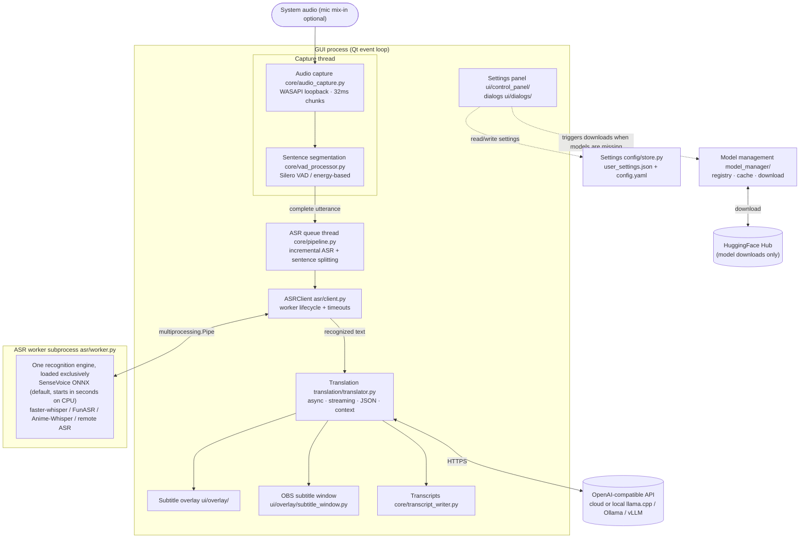

# Sublume

[繁體中文](README.md)｜English

Sublume is a real-time speech translation tool for Windows. It captures whatever the system is playing, runs speech recognition, translates the text through an LLM, and shows subtitles in a transparent overlay on top of the screen. Works for foreign-language videos, livestreams, and voice calls without touching any player settings.


## How it works

```
System audio (WASAPI) → VAD (Silero) → ASR → LLM translation → Overlay
        ↑ optional mic mix-in
```

Audio is captured in 32ms chunks; Silero VAD segments complete utterances and feeds them to the ASR engine, whose output goes to the configured translation model. Everything except the translation API runs locally, and ASR is CUDA-accelerated when an NVIDIA GPU is present.

## Features

- Multiple ASR engines: faster-whisper, SenseVoice, FunASR Nano, and Anime-Whisper (tuned for Japanese anime and galgames)
- Translation via any OpenAI-compatible API: cloud services such as OpenAI, or local ones such as Ollama, llama.cpp server, and vLLM — with a local model the whole pipeline runs offline
- Without a local GPU, speech recognition can be offloaded to another GPU machine on the LAN — see [REMOTE_ASR.md](docs/REMOTE_ASR.md)
- Streaming character-by-character output; streaming, structured JSON, context history, and thinking can each be configured per model
- Microphone mix-in, so both sides of a voice call get translated
- Always-on-top overlay with click-through, dragging, and 14 color themes, plus a standalone subtitle window for OBS capture
- Transcripts of recognition and translation results are saved automatically
- Built-in benchmark for comparing translation models on speed and quality

## Requirements

- Windows 10 / 11
- No preinstalled Python needed: `install.bat` fetches Python 3.12 through uv (3.13 is excluded due to dependency support)
- NVIDIA GPU with CUDA 12.6 recommended (Blackwell GPUs such as the RTX 50 series need CUDA 12.8); CPU-only works but transcription is slower
- Network access to the translation API and HuggingFace (with a local translation model, network is only needed for the initial ASR model download)

## Install

### Portable build (no Python installation required)

Download `Sublume-portable-*.zip` from [Releases](https://github.com/moonstarsky37/Sublume/releases), unzip, and run `start.bat`. The first run downloads a portable Python 3.12 and installs dependencies matching the GPU.

### From source

```bash
git clone https://github.com/moonstarsky37/Sublume.git
cd Sublume
```

Run `install.bat`. The installer will:

1. Detect [uv](https://docs.astral.sh/uv/), installing it via winget if missing (falling back to the official install script)
2. Create the virtual environment from uv's own Python 3.12 — never the system Python (a broken or wrong-version venv is rebuilt automatically)
3. Detect the NVIDIA GPU and its compute capability, choosing CUDA 12.6 or 12.8 automatically, with a CPU-only option before installing
4. Install PyTorch and the remaining dependencies

The Windows system proxy is applied automatically during installation. Run `start.bat` to launch, and `update.bat` later to update (Git is installed via winget if missing).

<details>
<summary>Manual install</summary>

```bash
python -m venv .venv
.venv\Scripts\activate

# PyTorch (pick one)
pip install torch torchaudio --index-url https://download.pytorch.org/whl/cu126  # CUDA
pip install torch torchaudio --index-url https://download.pytorch.org/whl/cu128  # CUDA (RTX 50 series)
pip install torch torchaudio --index-url https://download.pytorch.org/whl/cpu    # CPU only

pip install -r requirements.txt
.venv\Scripts\python.exe main.py
```

</details>

## First launch

A setup wizard appears on first launch: click Start Download to fetch the Silero VAD and SenseVoice models (~1GB). The main UI opens once downloads finish. A download proxy can be set in the wizard if the connection to HuggingFace is unreliable.

## Translation API

Settings → Translation tab. Using a local llama.cpp server (`llama-server`) as the example:

| Parameter | Example (local llama-server) |
|-----------|---------|
| API Base | `http://localhost:8080/v1` |
| API Key | any non-empty value (e.g. `sk-local`; local servers don't check it) |
| Model | the model alias loaded by llama-server, e.g. `translategemma` |
| Proxy | `none` (direct local connection, bypassing any system proxy) |

With a local model the whole pipeline runs offline. Other services are configured the same way — just swap API Base and Model: `http://localhost:11434/v1` for Ollama (vLLM likewise), or a cloud service such as OpenAI with `https://api.openai.com/v1` + `gpt-4o-mini` and a real API key.

## Project layout

`main.py` at the repository root is a thin entry shim; the actual code lives in the `sublume/` package. `python main.py`, `python -m sublume`, and `start.bat` are equivalent ways to launch.

```
sublume/
├── main.py             Application core and startup flow
├── paths.py            Runtime data paths (config.yaml, models/, logs/, transcripts/)
├── model_manager/      Model detection, download (HuggingFace), and cache management
├── benchmark.py        Translation benchmark
├── core/               Audio capture (WASAPI loopback), Silero VAD, transcript writer
├── asr/                ASR backends, worker subprocess, remote ASR server and client
├── translation/        OpenAI-compatible translation client (streaming, JSON, context)
├── ui/                 Settings panel, dialogs, log window, overlay, OBS subtitle window
└── i18n/               UI locales and changelogs
funasr_nano/            Vendored model code
```

## Differences from upstream

This is a fork of [TheDeathDragon/LiveTranslate](https://github.com/TheDeathDragon/LiveTranslate). The main changes:

- **Models come from HuggingFace.** Upstream defaults to ModelScope, which is barely reachable on some networks; models you already downloaded keep working.
- **The first-run setup was redone** — no more 15-second auto-start countdown; close the app mid-download and the next launch resumes where it left off.
- **The UI and docs lead with Traditional Chinese**, and English and Simplified Chinese are still maintained.
- **Fixed plenty of everyday bugs.**
- **Added tests and CI.**
- **Major internal refactoring.** The multi-thousand-line source files are now small modules.

## Changelog

[English](sublume/i18n/CHANGELOG_en.md) | [繁體中文](sublume/i18n/CHANGELOG_zh-TW.md)

## Architecture

The pipeline flows through three kinds of execution units, all local: the GUI process owns the interface and translation, background threads own audio and queuing, and an ASR worker subprocess owns the recognition engine (switching engines replaces the subprocess, so models and VRAM are freed with it and the GUI never blocks).



Cross-thread UI updates always go through Qt signals; settings I/O goes only through `SettingsStore` (atomic writes + load-time migrations).

## Acknowledgements

This project is a fork of [TheDeathDragon/LiveTranslate](https://github.com/TheDeathDragon/LiveTranslate) (MIT); the core implementation of the audio pipeline, ASR engine integration and subtitle UI comes from upstream.

- [faster-whisper](https://github.com/SYSTRAN/faster-whisper) — Whisper inference via CTranslate2
- [FunASR](https://github.com/modelscope/FunASR) — SenseVoice / Fun-ASR-Nano
- [Anime-Whisper](https://huggingface.co/litagin/anime-whisper) — Japanese anime/galgame ASR
- [Silero VAD](https://github.com/snakers4/silero-vad) — Voice activity detection

## License

[MIT License](LICENSE)
