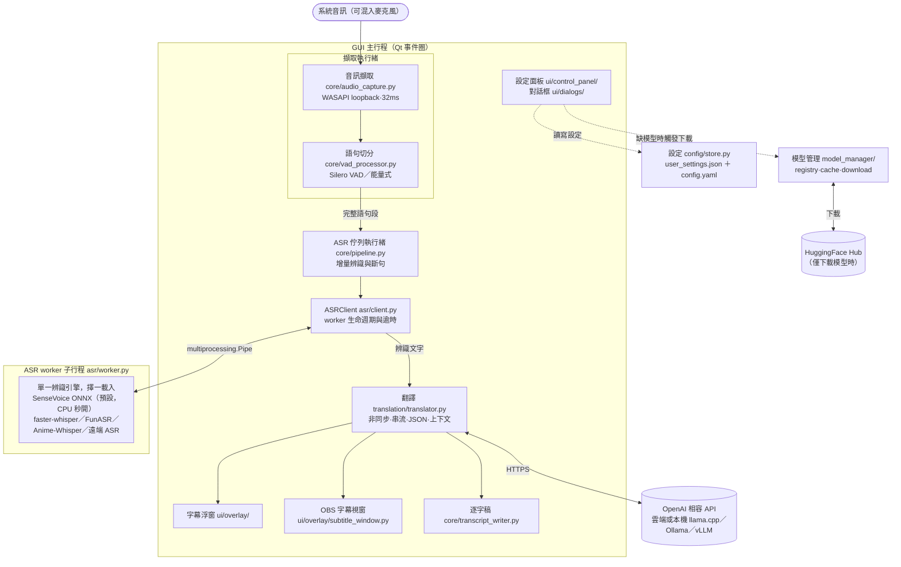
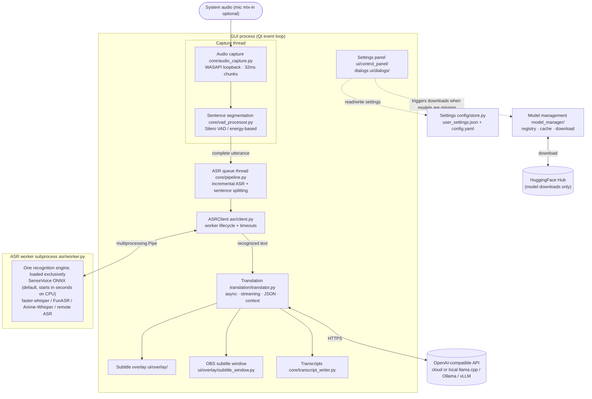

# 架構細節(維護文件)

> 這份是給貢獻者/維護者的:README 的「架構」節只放導覽段落與圖,
> 所有維護程序與實作說明集中在這裡。圖的規格 JSON 與本檔同目錄。

## 圖的三份來源與同步規則

| 檔案 | 角色 |
|---|---|
| `docs/architecture.zh.json` / `docs/architecture.en.json` | archviz 規格(產 SVG 的唯一來源) |
| `screenshot/architecture-zh.svg` / `-en.svg` | README 嵌入的預渲染圖 |
| 本檔下方的 mermaid 區塊 | 文字版(review 與 diff 友善) |

**改架構時三者一起改**。SVG 重產(archviz 為維護者本機工具,JSON 驅動):

```
uv run archviz docs/architecture.zh.json --name architecture-zh -o screenshot
uv run archviz docs/architecture.en.json --name architecture-en -o screenshot
```

(README 原本直接嵌 mermaid,GitHub render 失敗「Unable to render rich display」,
2026-08-10 起改嵌 SVG。)

## 實作要點

- 跨執行緒的 UI 更新一律走 Qt signal。
- 設定檔讀寫只經過 `SettingsStore`(原子寫入+載入時遷移):寫入先落 `.tmp` 再
  `os.replace`,程式中途當掉設定檔也不會損毀;舊版設定鍵在載入時自動升級並寫回。
- ASR worker 是 multiprocessing **spawn** 子行程:任何入口/探針腳本必須有
  `if __name__ == "__main__"` 守衛,否則 worker re-import 時會執行模組層代碼。
- 切換辨識引擎 = 汰換整個 worker 子行程,模型與 VRAM 隨行程釋放,GUI 不阻塞;
  目標載入失敗時以保存的前一組 worker 設定還原。

## mermaid 文字版(zh)



## mermaid 文字版(en)


